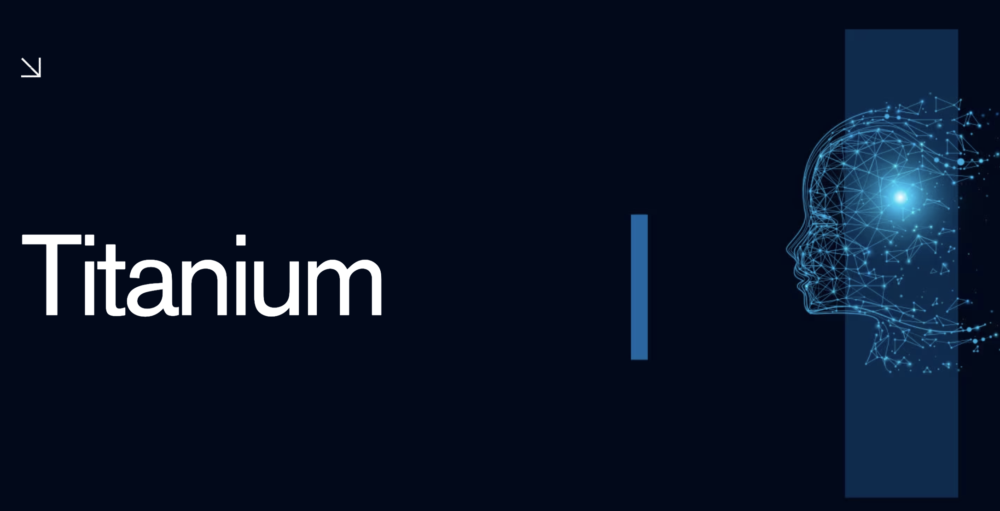

## Problem Statement
In today’s dynamically evolving technology landscape, public and private sector organisations are eager to leverage AI and automation to optimise their operations, but don’t necessarily know where to start. From analysis public data to streamlining processes, there are so many real world applications of AI that government agencies are struggling to create a plan on how to enhance their operations in an ethical and transparent manner while considering ethics, data privacy and security and winning over public trust. There seems to be a real need as well as hesitance around usage of AI, specially in the public sector.

## Solution
This is where our solution, Titanium comes into play. Titanium is a RAG Application built using Amazon Bedrock and trained on gigabytes of publicly available workforce and task based data. Titanium analyses an organisation’s operations by performing an assessment and breaking down each employee’s work into individual tasks. It assesses which tasks can be  accelerated using AI, revealing insights like jobs or functions in an organisation that can benefit the most from AI. This gives executives and decision makers a practical guide on how they can harness this powerful technology, all while addressing concerns around data governance, security and privacy.

## Infrastructure Setup
1. Install Terraform: https://www.terraform.io/downloads.html
2. Set up your AWS credentials.
3. Navigate to the `infrastructure/` directory.
4. Run `terraform init` to initialize the project.
5. Run `terraform apply` to create the S3 bucket and IAM roles.

## Fine-Tuning the Titan Model
1. Install dependencies: `pip install -r model/requirements.txt`
2. Run the fine-tuning script: `python model/fine_tune.py`
3. The fine-tuning job will start, and the output will be saved to the S3 bucket.

## Running the Streamlit App
1. Navigate to the `streamlit_app/` directory.
2. Install dependencies: `pip install -r requirements.txt`
3. Run the Streamlit app: `streamlit run app.py`
4. View the insights generated by the fine-tuned AI model in your browser.

## License
MIT License